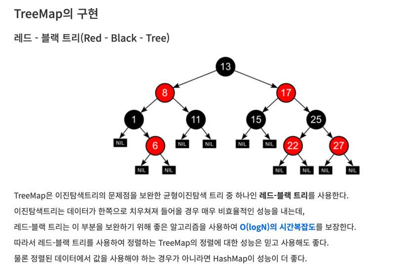

자료구조편 - Map

> LinkedHashMap, HashMap, TreeMap

이 중 TreeMap에 대해서 더 알아보자 


>TreeMap전에 sort때도 생각했던 그림이지만 TreeMap은 다음과 같은 문제에서 사용할 수 있을 것 같다.

## BJ_7785
입력: 2~10^6개.

-> 생각한 점: 10^9개가 아니니 일단 int로도 해결이 되겠구나!

> 회사에는 동명이인이 없으며, 대소문자가 다른 경우에는 다른 이름이다. 사람들의 이름은 알파벳 대소문자로 구성된 5글자 이하의 문자열이다.

이 부분에서 키값을 등록할 때를 상상해보면 이름 다르면 새로운 키값으로 등록하는 아이디어를 생각.

> 추가조건: 현재 회사에 있는 사람의 이름을 사전 순의 역순으로 한 줄에 한 명씩 출력한다.

## TreeMap의 특징
입력 순서 보장하지 않으며, 정렬된 순서로 저장되어 출력됨
검색기능 O(log(n)) 시간복잡도, Red Black Tree 자료구조로 이루어짐
null Key 허용 안함 ( Null Pointer Exception 발생)

## LinkedHashMap의 특징
입력 순서 보장
검색기능 O(1) 시간복잡도, DoubleLinkedList 자료구조로 이루어짐
null Key 허용
HashMap과 동일하게 좋은 성능을 가지지만 LinkedList를 구성하고 있어야 해서 메모리를 좀 잡아먹는다.
또한, 멀티 스레드 환경에서도 좋지않다고 하니 참고.

즉, 우리가 가지고 있는 자료구조의 특징을 볼 때 **TreeMap**을 사용하고 reverseOrder로 출력하는 것이 베스트 아닐까? 생각함.

```java
static TreeMap<String, String> map = new TreeMap<>();
	public static void main(String[] args) throws IOException {
		BufferedReader br = new BufferedReader(new InputStreamReader(System.in));
		int n = Integer.parseInt(br.readLine());
		for (int i=0;i<n;i++){
			String[] temp = br.readLine().split(" ");
			if (temp[1].equals("enter")){
				map.put(temp[0], temp[1]);
			}else{
				map.remove(temp[0]);
			}
		}
		map.descendingKeySet().forEach(
			System.out::println
		);

	}
```
정답 처리 되긴했지만 더 어려운 문제라면 여기서 없는데 leave를 입력받는등 다양한 엣지 케이스를 더 만들 수 있을 것 같긴하다.
HashMap 정리하기에 좋은 예제인듯.