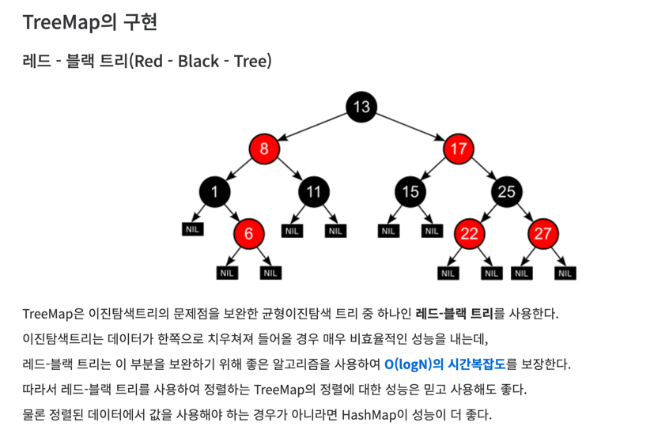

## java 정렬

BJ_26265
> 키값으로 정렬하고 value값으로 정렬하는 것이
이번 문제였다.

>TreeMap을 먼저 생각을 했지만, key로 한번, value로 다시 정렬하는 것말고
한번에 정리를 어떻게하지 생각을 했지만, 차라리 Node클래스로 mento, menti로 묶는 형식으로 생각하고
comparator를 Node를 넣어서 구현하는 방식으로 정렬을 했다.
